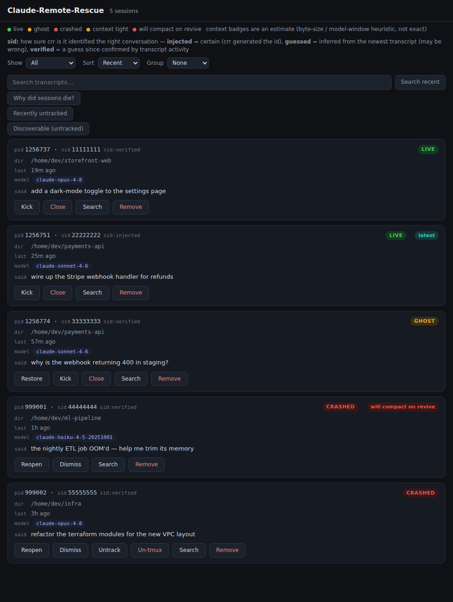
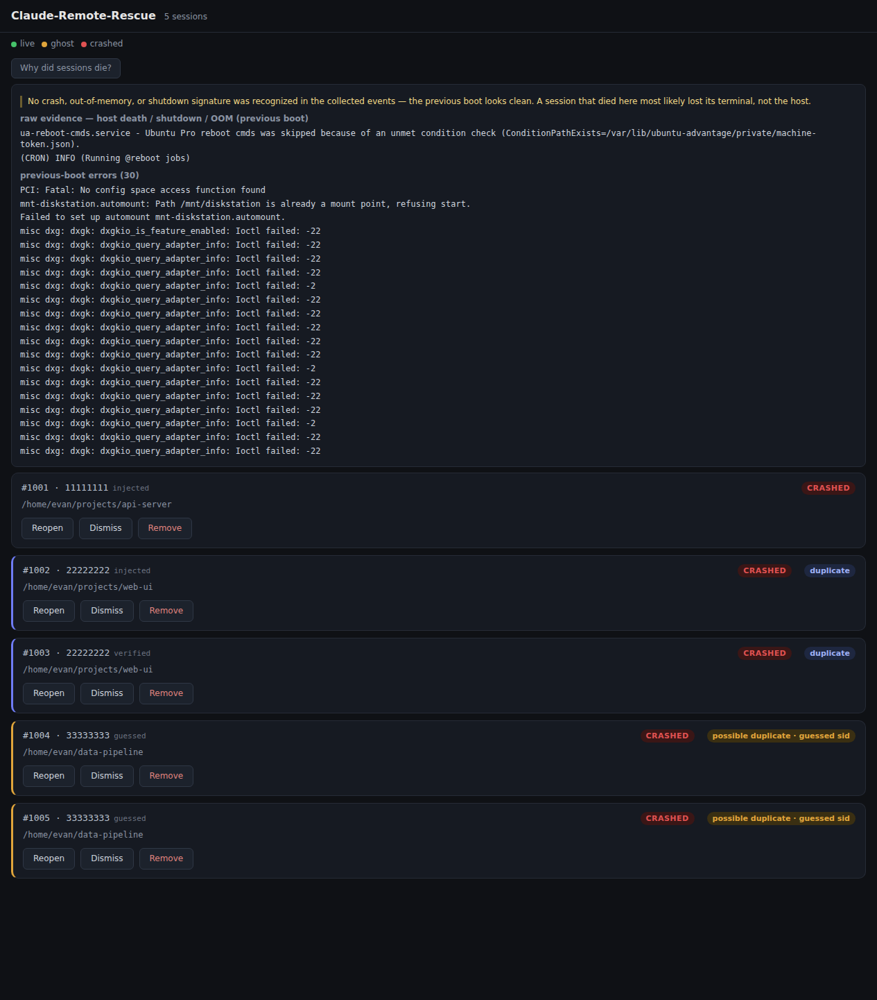

# Claude-Remote-Rescue

Keep your Claude Code sessions alive — and rescue them from your phone —
when terminals, shells, or whole machines die.

When a terminal window closes, a laptop reboots, or a VM runs out of
memory mid-conversation, Claude-Remote-Rescue notices, revives each
session (`claude --resume`) into tmux, and gives you a tailnet-only web
dashboard to reopen, dismiss, or remove any session from any device. It
also tells you *why* things died (journald — translated to plain English).

Not affiliated with Anthropic. MIT licensed.

Docs: [docs/site/](docs/site/) — servable via GitHub Pages.

## Status

**Phases 1–4 code is on `main` (v0.1.0).** Headless Linux (Phase 1) plus the
platform adapters — macOS (Phase 2: boot identity, launchd, Terminal.app /
iTerm2 tab-spawn, `log show`/`pmset` diagnostics), Linux desktop (Phase 3:
gnome-terminal / konsole / kitty / wezterm), and Windows/WSL (Phase 4:
`wt.exe` spawn, Scheduled Task, WinEvent + WSL-OOM diagnostics) — are built,
along with guessed/verified resume-sid tracking and the batched status probe.
See [DESIGN.md](DESIGN.md) and [ROADMAP.md](ROADMAP.md).

Honest calibration — what is and isn't verified:

- **Verified:** the Linux CI matrix (ubuntu, Python 3.11/3.12), the
  `node --check` page-JS gate, and the import-linter layering contract all
  pass. Business logic is covered by unit tests with fakes. `kick` and
  `close` (they signal live processes) and the shim repair loop (the
  `claude()` wrapper's post-exit relaunch/close/crash-offer branching) are
  shipped; the repair loop is also live-verified on Linux/WSL (fish) in
  isolation.
- **NOT yet verified:** the macOS-runner tests (`plutil`, `osacompile`,
  `log show`/`pmset`, mac boot-identity) have not run on this batch; any real
  GUI tab spawn (macOS/Linux-desktop/`wt.exe`) and all Windows integration
  are unrun; and the **end-to-end hardware acceptance** — kill the tmux
  server, reboot, watch every conversation revive and the dashboard return
  over the tailnet — has not been run. These are the next milestone.

This is a ground-up OSS rewrite of a private Windows/WSL tool that
survived two real outages in production (a Windows-Update reboot and a WSL
OOM crash) with zero lost conversations; every decision marked **[lesson]**
in DESIGN.md was paid for the honest way.

## Dashboard

A tailnet-only, loopback-bound web dashboard for reopening, dismissing, or
removing any session from any device.



Each card carries a state badge (live / ghost / crashed), the `#pid · sid8`
identity, the sid's provenance (`injected` / `guessed` / `verified`), and the
last human prompt. Duplicate detection is **confidence-weighted** (audit P3):
two sessions that share an `injected`/`verified` id are a real **duplicate**
(blue); a collision that involves a `guessed` id is only a **possible
duplicate · guessed sid** (amber), because two `--continue` tabs can guess the
same newest transcript.



The lazy "Why did sessions die?" panel leads with a **plain-English verdict**
(out-of-memory, kernel panic, unexpected shutdown, clean reboot, or "looks
clean") above the raw journald/WinEvent evidence.

## Install (headless Linux)

Requires Python ≥ 3.11 and `tmux`. Zero runtime dependencies otherwise.

```sh
pipx install claude-remote-rescue      # or: pip install --user .
```

1. **Shell shim** — source it from your rc file so shells journal
   themselves and `claude` launches become identifiable:
   ```sh
   crr shim fish >> ~/.config/fish/config.fish     # or: bash -> ~/.bashrc, zsh -> ~/.zshrc
   ```
2. **Watchdog + dashboard** — install the user services (autonomous revival
   + a dashboard that survives logout/reboot):
   ```sh
   crr systemd --install       # prints first with no args, so you can inspect
   ```
3. **Expose the dashboard on your tailnet** (loopback-only by default):
   ```sh
   tailscale serve --bg 8377
   ```
4. **Check the install:**
   ```sh
   crr doctor
   ```

## Commands

| Command | What it does |
| --- | --- |
| `crr status [--json]` | List journaled sessions and their state (live / ghost / crashed) |
| `crr revive` | Revive crashed claude sessions into detached tmux (the watchdog runs this) |
| `crr reopen --pid N` (alias `crr restore --pid N`) | Revive one specific crashed or ghost session now (ghost: closes the orphaned shell and archives the conversation for revival) |
| `crr dismiss --pid N` | Clean up a crashed session without reviving (archives it) |
| `crr remove --pid N` | Delist a session, touch nothing else |
| `crr kick <pid>` | Restart claude in place on the same conversation |
| `crr close <pid>` | End a live session (remote exit); no revival |
| `crr untrack <pid>` (alias `crr detmux <pid>`) | Stop tracking a session — re-home a revived tmux session into a visible tab, archive it, and delist it (dashboard button: `Untrack` — the tab still runs tmux underneath) |
| `crr untmux <pid>` | Kill a parked tmux session and relaunch `claude --resume` directly in a visible tab, no tmux wrapper left behind (dashboard button: `Un-tmux`, confirm-gated) |
| `crr retrack [--last N \| --sid ID]` | Undo untrack/detmux: restore the N most-recently untracked sessions (default 10), or one by `--sid`, back into crr's management |
| `crr discover [--adopt SID]` | List untracked transcripts crr never journaled, or adopt one with `--adopt` into crr's management (revive via `crr reopen`; the watchdog may start a second `claude --resume` if the session is still alive elsewhere) |
| `crr adopt SID [--takeover] [--wait N]` | Adopt a discoverable session id. Plain, this is identical to `crr discover --adopt SID` — a session recorded as recoverable, not attached to any process. With `--takeover` (**destructive, default off**): first locate the live `claude --resume SID` process, wait for it to reach a clean turn boundary (an idle transcript ending in a finished assistant turn — never mid-tool-call or mid-reply), stop it in a way the shim's repair loop won't silently respawn, then adopt — so the watchdog's later revive is a genuine takeover: the sole `claude --resume SID` on that conversation, not a second one racing the first. Refuses (never kills) if: no live `--resume SID` process can be found (a freshly-started, non-`--resume` claude generates its sid internally and can't be located this way — start it with `--resume` first, or adopt without `--takeover`); it's still actively writing past `--wait` seconds (default: config `takeover_max_wait_seconds`, 180s); it goes quiet but is parked mid-turn or mid-reply, not a safe boundary; or the sid becomes tracked by something else in the small window before the kill |
| `crr rescued` | List conversations the reviver already parked in tmux from a previous boot, awaiting re-home |
| `crr diagnose [--json]` | Explain why the previous boot / sessions may have died |
| `crr gc` | Drop archive records past the retention window |
| `crr archive --list` | List archived (revival-preserved) sessions: reason, archived-at, sid8, cwd |
| `crr recall <query> [--pid N \| --sid ID \| --all] [--cwd DIR] [-n N]` | Search a session's transcript for earlier conversation (print-only, never re-injects) |
| `crr web [--port N]` | Serve the dashboard (loopback only) |
| `crr systemd [--install\|--uninstall]` | Print (or install/uninstall) the Linux watchdog timer + dashboard service |
| `crr launchd [--install\|--uninstall]` | Print (or install/uninstall) the macOS launchd user agents (watchdog + dashboard) |
| `crr schtasks [--install\|--uninstall]` | Print (or install/uninstall) the Windows/WSL Scheduled Tasks (watchdog + dashboard) |
| `crr config --effective` | Every config key with its value and origin (`configured` / `default`) |
| `crr doctor` | Install-health checklist |
| `crr shim <shell>` | Print the shell shim to source from your rc file (fish/bash/zsh) |
| `crr repair-check --pid N` | [shim] Read/clear a session's relaunch/close flag |
| `crr rescue-check` | [shim] Once per boot, offer to re-home rescued conversations into visible tabs |

Targets: headless Linux (now), macOS / Linux-desktop / Windows-WSL (later).
Shells: zsh, bash, fish.
